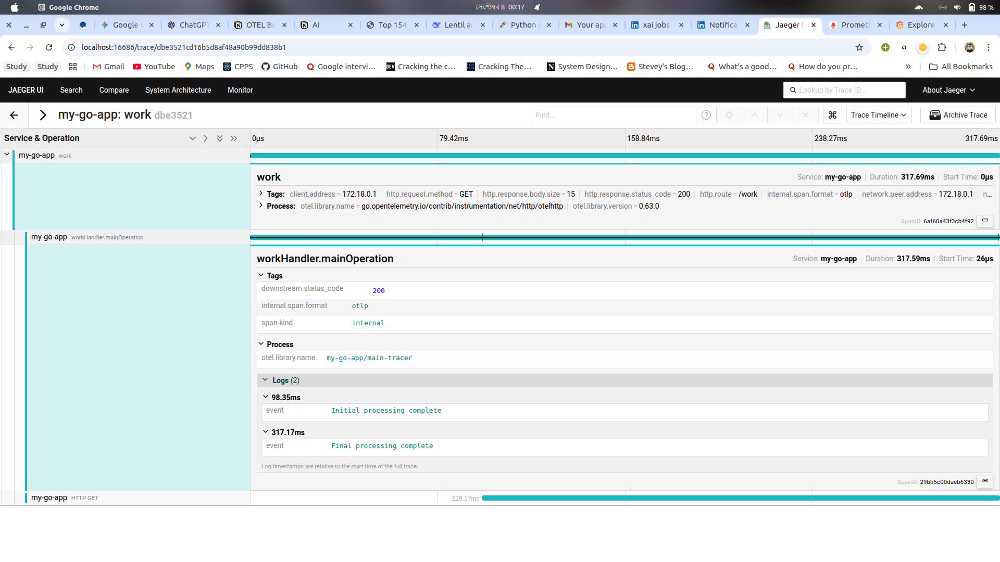
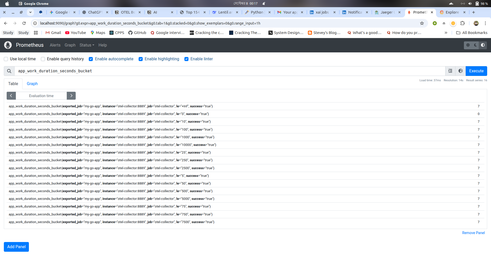
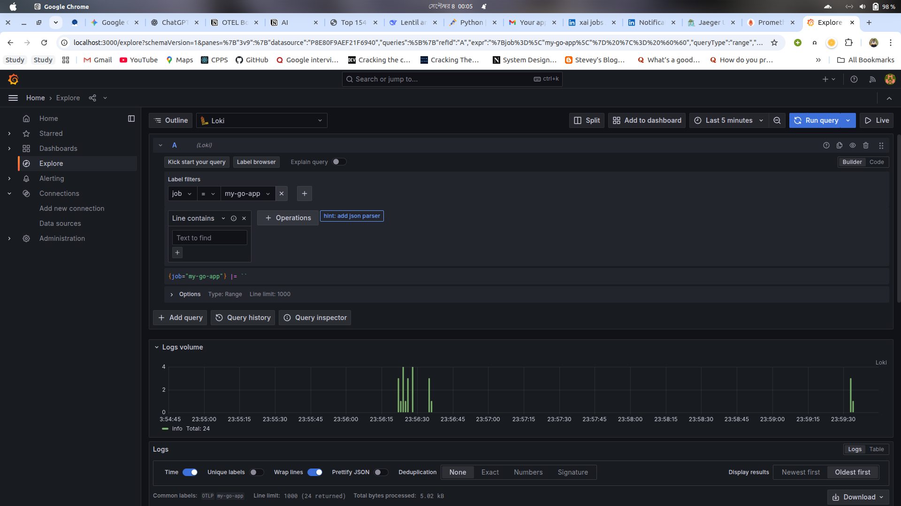

Go Application with Full OpenTelemetry Observability Stack
This project demonstrates a Go web application instrumented with OpenTelemetry to generate traces, metrics, and logs. The telemetry data is sent to an OpenTelemetry Collector, which then routes it to a full backend stack including Jaeger for tracing, Prometheus for metrics, and Loki for logging, all visualized through Grafana.

Prerequisites
Docker

Docker Compose

Directory Structure
Ensure your project files are organized as follows before running the application:

.
├── docker-compose-otel.yaml
├── go-app/
│   ├── Dockerfile
│   ├── go.mod
│   └── main.go
├── grafana/
│   └── provisioning/
│       └── datasources/
│           └── datasources.yml
├── otel-collector/
│   └── otel-collector-config.yml
└── prometheus/
└── prometheus.yml

How to Run the Stack
Start all services using Docker Compose. From the root directory of the project, run the following command:

docker compose -f docker-compose-otel.yaml up --build

This will build the Go application image and start all the necessary containers (Go App, OTel Collector, Jaeger, Prometheus, Loki, and Grafana).

Generate Telemetry Data: Once the services are running, open a new terminal and send some HTTP requests to the Go application's endpoints to generate traces, metrics, and logs.

Simple endpoint:

curl http://localhost:8080/hello

Endpoint with simulated work and a downstream call (best for traces):

curl http://localhost:8080/work

Run a loop to generate continuous data:

while true; do curl http://localhost:8080/work; sleep 2; done

Accessing Your Telemetry Data
1. Traces in Jaeger
   Jaeger collects and visualizes the traces, showing the journey of a request through your application, including calls to other services.

URL: http://localhost:16686

How to view:

Open the Jaeger UI.

In the "Service" dropdown on the left, select my-go-app.

Click "Find Traces". You will see a list of recent traces.

Click on a trace corresponding to a /work request to see the distributed trace. You'll see the workHandler span and, nested within it, the call to the /downstream endpoint, giving you a complete view of the request flow.

2. Metrics in Prometheus & Grafana
   The application exports three custom metrics that are scraped by Prometheus.

Prometheus URL: http://localhost:9090

Grafana URL: http://localhost:3000 (Login: admin / admin)

Metrics Exported:

http_server_requests_total: Total request count.

http_server_active_requests: Current in-flight requests.

app_work_duration_seconds: Histogram of the /work endpoint's duration.

How to view in Grafana:

Open Grafana and navigate to the Explore view (compass icon).

Select the Prometheus data source from the dropdown at the top.

In the "Metric" field, you can start typing any of the metric names (e.g., app_work_duration_seconds_bucket) and run the query to see the raw data or build graphs.

3. Logs in Grafana (via Loki)
   Loki aggregates logs from your application. They are automatically correlated with traces.

Grafana URL: http://localhost:3000

How to view in Grafana:

Open Grafana and navigate to the Explore view.

Select the Loki data source from the dropdown.

Use the Log browser to build a query. Select the label service_name and the value my-go-app.

Run the query {service_name="my-go-app"}.

You will see all the logs from your Go application. You can expand a log line to see its labels, including the trace_id. Grafana will often provide a button to pivot directly to the corresponding trace in Jaeger.

Stopping the Application
To stop and remove all the running containers, press Ctrl+C in the terminal where Docker Compose is running, and then run:

docker compose -f docker-compose-otel.yaml down

